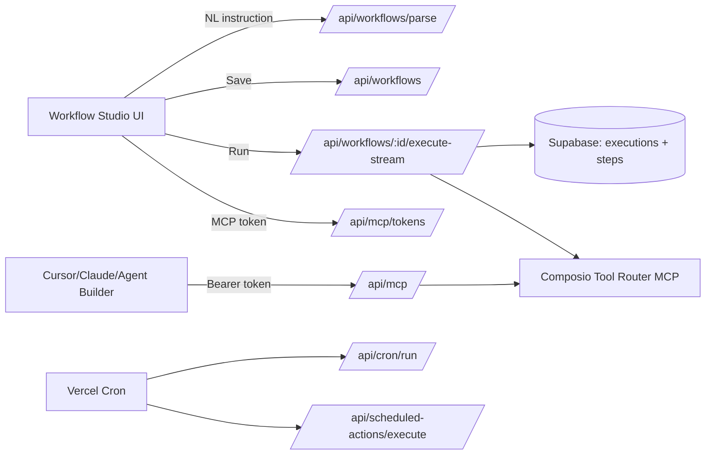

# Implementation Plan (Full Rube-style Clone)

## Current State Audit (What already exists)
- Next.js App Router + Tailwind + Supabase Auth + Supabase Postgres
- Composio integration (tool router session + OAuth connect/callback)
- Workflow tables + basic workflow parser + execution timeline UI

## Target Architecture

### High-level flow

### Data model
- `workflows`: workflow definitions (JSONB steps)
- `workflow_executions`: per-run tracking
- `execution_steps`: step timeline/logs
- `model_configurations`: per-user provider + model overrides
- `mcp_access_tokens`: per-user MCP access tokens for external clients
- `workflow_schedules`: cron schedules for workflows
- `scheduled_actions`: time-based “do this later” actions

## API Surface

### Workflows
- `GET /api/workflows` → list workflows
- `POST /api/workflows` → create workflow
- `GET/PUT/DELETE /api/workflows/:id` → workflow details/update/delete
- `POST /api/workflows/parse` → NL → structured workflow (OpenAI default; Gemini fallback)
- `POST /api/workflows/:id/execute-stream` → runs workflow with SSE events + persists execution timeline
- `GET /api/executions/:id/timeline` → polling-friendly timeline fetch

### Composio connectors
- `GET /api/composio/toolkits` → marketplace catalog (filter + pagination)
- `GET /api/composio/tools?toolkit=...&userId=...` → tool discovery per toolkit
- `POST /api/composio/connect` → starts OAuth flow
- `GET /api/composio/callback` → OAuth callback redirect

### MCP exposure (cross-client)
- `GET/POST/DELETE /api/mcp/tokens` → create/list/revoke tokens
- `POST /api/mcp` → MCP proxy (Bearer token → forward JSON-RPC to Composio MCP)

### Model management
- `GET/PUT /api/models/config` → per-user provider + model settings

### Scheduling
- `PUT/GET/DELETE /api/workflows/:id/schedule` → manage cron schedules
- `POST /api/cron/run` → cron runner for workflow schedules
- `POST /api/scheduled-actions/execute` → cron runner for scheduled actions

## UI Plan (Rube-like UX)
- Workflow Studio (`/studio`)
  - Left: workflow list
  - Top-left: “instruction → generate → save”
  - Center: step editor (name/type/app/action + parameters JSON)
  - Right: real-time run timeline (SSE)
- Marketplace (`/marketplace`)
  - Search/filter/pagination
  - “Connect” triggers OAuth via `/api/composio/connect`
- Settings
  - Model settings (`/settings/models`)
  - MCP tokens (`/settings/mcp`)

## Deployment Plan
- Vercel deployment
  - `vercel.json` cron schedules for:
    - `/api/cron/run` (workflow schedules)
    - `/api/scheduled-actions/execute` (scheduled actions)
  - Env vars configured in Vercel project settings
- Docker
  - `Dockerfile` for containerized Next.js build and run
  - `docker-compose.yml` for local container runs

## Testing Plan
- Unit tests (Vitest)
  - Crypto sealing (token/secret encryption)
  - Pure parsing helpers
- E2E tests (Playwright)
  - Smoke test: `/api/mcp` health
  - Add auth-protected route assertions as Supabase test env is available

